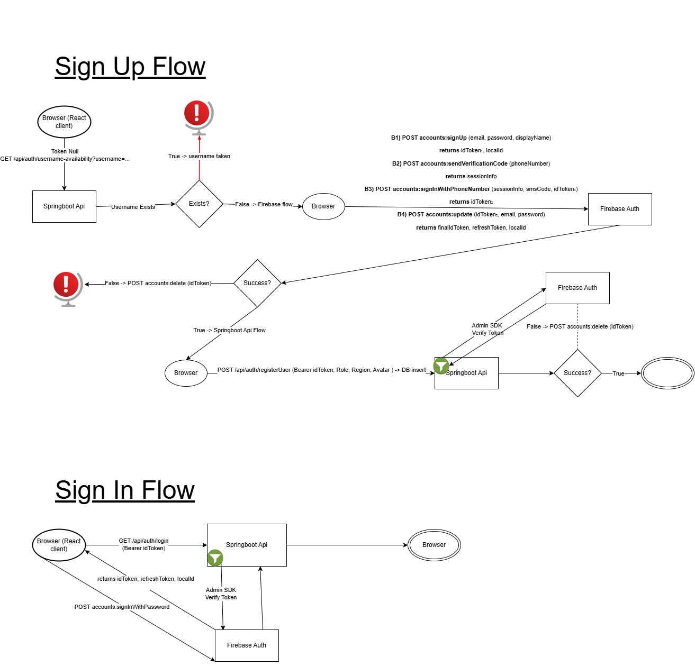
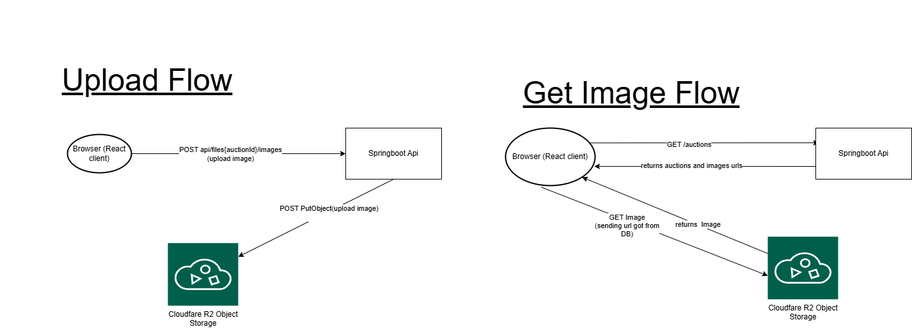

## Architecture (High-level)

- **Frontend:** React (Vite) SPA served as static assets.
- **Backend:** Spring Boot application (REST API + schedulers + async tasks).
- **Auth:** Firebase Authentication  
  - Frontend uses Firebase Client SDK to sign in and obtain an ID token.  
  - Backend verifies the token using Firebase Admin SDK.
- **Database:** PostgreSQL stores application data (users, auctions, bids).
- **Storage:** Images are stored in **Cloudflare R2** and served via **public URLs**.
- **Image flow:** Backend uploads images to R2, saves the public URL in the DB, and returns URLs to the frontend. The browser then loads images directly from R2.
- **Failover:** API runs in an active–passive setup behind a load balancer (routes traffic to Primary; fails over to Standby on health check failure).

## Tech Stack
- Java 17
- Spring Boot
- PostgreSQL
- Firebase Authentication (Client + Admin SDK)
- Cloudflare R2

## Main External Apis Communication Flows

### Firebase

### Cloudfare Object Storage R2
