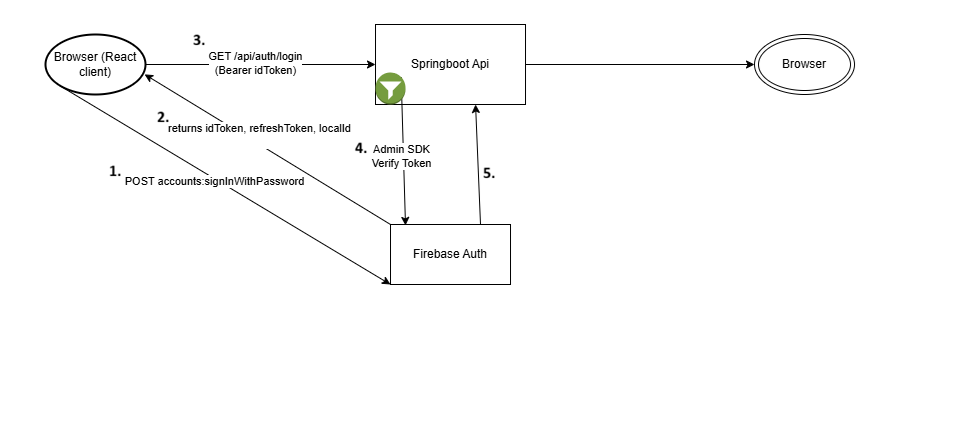
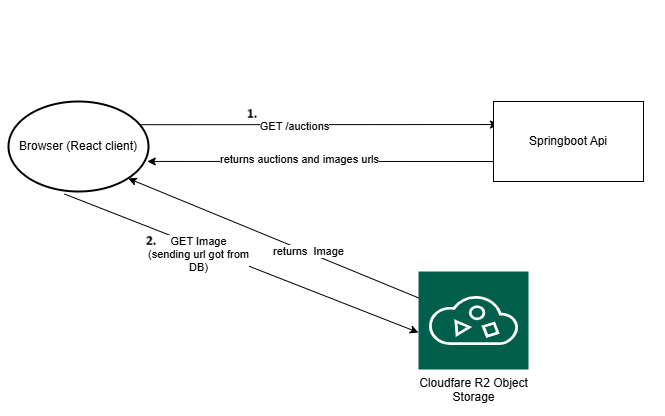
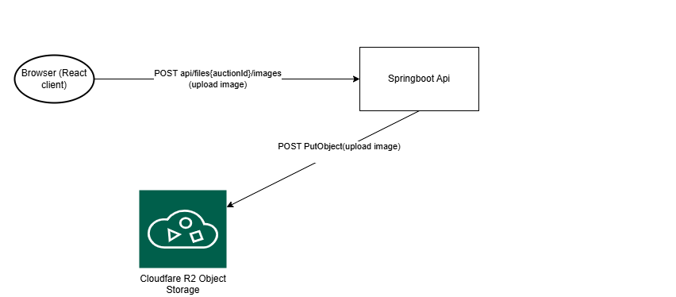

# Quick Demo / API Access

A live instance of the backend is available for evaluation and testing.

**Swagger UI**  
https://springboot-backend-app.onrender.com/swagger-ui/index.html

## Authentication (Firebase) - Get JWT token

- Press Authorize Button:
  - username: ken@example.com
  - password: Password123
  - press authorize button again
- You are now signed in and can use other endpoints

## Important endpoints to use:
1) GET /auctions: 
   - Getting active auctions' important details, this can be used for building the auctions page where users can filter and view all the auctions page by page
2) POST /auctions:
   - Creating an auction. User can create an auction and is then going to be in pending status for admin to approve before getting active
3) GET /actions/{id}:
   - Users can view more details about the auction such as description and auction's chat
4) GET /auctions/my:
   - Inspect your active auctions
5) POST /api/files/{auctionId}/images:
   - Uploads a set of images for a specific auction
6) POST /api/bids/{auctionId}/placeBid:
   - Bid on a specific auction
7) GET /api/auth/username-availability:
   - Checking for signup if a user with same username already exists, preventing username conflicts
8) GET /api/auth/profile:
   - Check your user's profile information
9) POST /api/auctions/chat/{auctionId}/sendMessage:
   - User can send a message to a specific auction if user is eligible for chatting
10) GET /api/auctions/chat/{auctionId}/getChat:
   - Get the chat of a specific auction
11) POST /api/admin/notifications/broadcast:
   - Broadcast a notification to every user
12) GET /api/admin/referralCodes
   - Get all referral codes
13) PATCH /api/admin/auctions/pending 
    - As admin approve a pending auction to make it active

---

## Diagram shows an optional active–passive deployment model; current deployment uses a single instance and is deployed to expose a Swagger UI for easy review and testing.*

## Architecture (High-level)

- **Frontend:** React (Vite) SPA served as static assets.
- **Backend:** Spring Boot application (REST API + schedulers + async tasks).
- **Auth:** Firebase Authentication
  - Frontend uses Firebase Client SDK to sign in and obtain an ID token.
  - Backend verifies the token using Firebase Admin SDK (JWT verification at the API boundary).
- **Database:** PostgreSQL stores application data (users, auctions, bids).
- **Storage:** Images are stored in **Cloudflare R2** and served via **public URLs**.
- **Image flow:** Backend uploads images to R2, stores the public URL in the DB, and returns URLs to the frontend. The browser then loads images directly from R2.
- **Planned → Failover:** API runs in an active–passive setup behind a load balancer (routes traffic to Primary; fails over to Standby on health check failure).
- **Planned → Scheduler Execution Model:** Scheduled jobs are enabled only on the primary instance, if primary is down,then secondary's instance schedulers are automatically enabled
---

## Tech Stack
- Java 21
- Spring Boot
- PostgreSQL
- Firebase Authentication (Client + Admin SDK)
- Cloudflare R2

---

## System Internals (Design Notes)

### Persistence (JPA / Database)
- **JPA/Hibernate** is used for persistence and domain modeling.
- An **Admin user** is created manually in the database for security.

### Async Processing (Notifications / Emails / Auditing)
- Notifications and email events are handled **asynchronously** to keep request latency low.
- Each Api call is **logged to the database** to support:
  - **Auditability** (who/what/when),
  - **Analytics** 

### Caching Strategy
- ** Planned todo → page-level caching for popular auctions
- 
### Reliability: Retry Services 
To reduce failure rates caused by transient connectivity issues:
- **FirebaseRetryService** retries transient Firebase calls, in order to maintain a high level of consistency with the database.
- **R2RetryService** retries transient Cloudflare R2 operations (uploads/updates) to improve success rates.
- Retries are designed to be **bounded** (no infinite loops) and safe for transient network errors.

### Schedulers (Background Jobs)
Schedulers are used for lifecycle management and consistency:

- **Auction expiration scheduler**
  - Periodically marks auctions as **expired**.

- **Reminders scheduler**
  - Sends reminder notifications/emails.

- **Nightly consistency scheduler (DB ↔ Firebase)**
  - Ensures the system remains consistent between **PostgreSQL** (application source-of-truth) and **Firebase Auth** (identity provider).
  - Example actions:
    - If a user exists in **Firebase** but is missing in **DB** → the Firebase user is **deleted**.
    - If Firebase user metadata differs from DB → Firebase data is **updated** to match DB.

### Security (API Boundary)
- **RateLimiter filter** (cache-backed) protects the API from abuse and reduces brute-force attempts.
  - For public Apis cache user's IP
  - For secured Apis cache user's firebase Id.
- **Firebase auth filter** enforces:
  - Presence/validity of `Bearer idToken`,
  - User existence in the application database (prevents "valid token but unknown user" edge cases).

#### Planned Security Improvements
- **XSSSanitizationFilter** is planned to sanitize untrusted inputs at the API boundary.

---

## Realtime Features (Roadmap)

### WebSockets
Real-time communication supports:
- **Live bids updates** in auctions.
- **Auction chat** between participants with near real-time delivery.

Implementation includes, Event-driven updates.

WebSocket communication does not use an intermediate message broker
- As a result, WebSocket connections are handled by a **single active application instance** at any given time.

---

## Main External APIs Communication Flows

### Firebase Authentication

#### Planned: Sign In Flow
- **User signs in on the client** using email/password via Firebase Authentication.
- Firebase returns **`idToken`, `refreshToken`, `localId`** to the browser.
- The browser calls the backend **`GET /api/auth/login`** with `Authorization: Bearer <idToken>`.
- Backend **verifies** the token using **Firebase Admin SDK** and returns the application user context.

#### Planned: Sign Up Flow
- The client checks **username availability** via the backend before creating an auth account.
- The client completes the Firebase registration flow and obtains a valid **ID token**.
- The browser sends the final signup payload to the backend with `Authorization: Bearer <idToken>`.
- Backend verifies the token, persists the user in PostgreSQL, and returns the created user/auth info.
- In case of failures after account creation, the flow supports **rollback** (cleanup of incomplete Firebase accounts).

---

### Cloudflare R2 Object Storage

#### Planned: Get Image Flow
- The browser fetches application data from the backend (auctions), which includes **public image URLs** stored in the DB.
- The browser then downloads images **directly from Cloudflare R2** using those URLs.
- This keeps the backend out of the heavy bandwidth path and improves performance.

#### Upload Image Flow
- The browser uploads an image to the backend (protected endpoint).
- Backend uploads the binary to **Cloudflare R2** and generates a **public URL**.
- Backend stores the image URL/metadata in PostgreSQL and returns the URL to the client.

